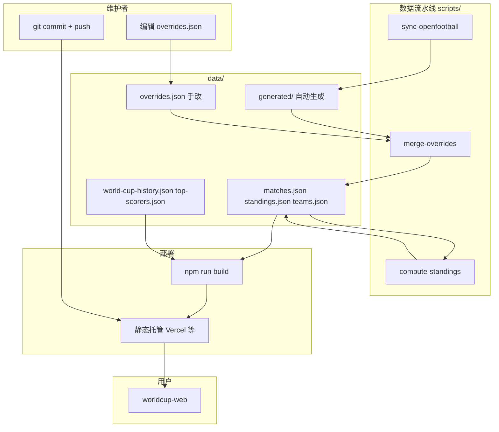

# MVP 实施计划（Web 优先 · 静态数据）

> 修订日期：2026-06-05  
> 策略：**可分享的移动端 Web** 验证需求；**静态 JSON + 脚本** 维护数据；**Supabase / 管理后台 / 小程序** 延后至二期。

## 1. 目标

### 要验证什么

| 假设 | 验证方式 |
|------|----------|
| 用户愿意查 2026 世界杯赛程/积分榜 | 链接分享后有人访问、有回访 |
| 三 Tab 信息架构够用 | 赛程 / 积分榜 / 历史 停留与反馈 |
| 开放数据 + Git 维护能撑住 MVP | overrides 改分 → push → 线上可见 |
| 非官方工具合规可接受 | 免责声明可见，无侵权素材 |

### MVP 成功标准（满足任意 2 条即可进入二期）

- [ ] 用户端 Web 可公开访问，微信内打开无报错
- [ ] 至少 1 次完整数据流：`data:refresh` → 改 `overrides.json` → push → 用户端展示更新
- [ ] 3 个核心页面数据来自 `data/*.json`，非组件内硬编码
- [ ] 5 人以上真实用户通过链接使用过（朋友/群聊即可）

### 明确不做（一期 MVP）

- Supabase、管理后台、微信小程序
- 「动态资讯」模块（Kimi `FeedPage` 砍掉）
- 订阅消息、推送、C 端账号
- 淘汰赛实时对阵推演（静态占位即可）

### 二期再做

- Supabase + `worldcup-admin`（浏览器改分，秒级生效）
- 微信小程序（验证通过后再评估）
- 详见 [第 8 节](#8-二期衔接)

---

## 2. 架构



### 技术选型

| 层 | 选型 | 说明 |
|----|------|------|
| 用户端 | Vite + React + TS + Tailwind | 由 Kimi 原型迁移 |
| 数据 | 根目录 `data/*.json` | 构建时 import 进 bundle |
| 维护 | `scripts/` + `npm run data:*` | openfootball 同步 + overrides |
| 部署 | Vercel 或同类 | Git push 触发 build；`prebuild` 跑 `data:refresh` |
| 数据源 | openfootball + 手工 JSON | 见 `data/DATA_SOURCES.md` |

---

## 3. 目录结构

```
2026worldcup/
├── package.json              # 根脚本：data:sync / merge / refresh
├── tsconfig.scripts.json
├── data/
│   ├── README.md             # 文件分工说明
│   ├── overrides.json        # ★ 日常唯一手改（比分/状态）
│   ├── teams.json            # 生成：球队列表
│   ├── matches.json          # 生成：合并后赛程
│   ├── standings.json        # 生成：积分榜
│   ├── world-cup-history.json
│   ├── top-scorers.json
│   └── generated/            # sync 原始输出（可提交）
│       ├── teams.json
│       ├── matches.json
│       └── sync-meta.json    # 同步时间、数据源 URL
├── scripts/
│   ├── types.ts              # 与前端共享的数据类型
│   ├── paths.ts              # 路径常量
│   ├── sync-openfootball.ts
│   ├── merge-overrides.ts
│   ├── compute-standings.ts
│   └── refresh.ts            # 串联三步
├── worldcup-web/             # 用户端（Phase 2）
├── worldcup-admin/           # 【二期】管理后台占位
├── supabase/                 # 【二期】数据库占位
├── worldcup-mini/            # 【二期】小程序占位
└── docs/
    └── MVP_PLAN.md           # 本文件
```

---

## 4. 数据文件分工

| 文件 | 手改？ | 生成方式 |
|------|--------|----------|
| `data/overrides.json` | ✅ **常规唯一手改** | 你 |
| `data/generated/*` | ❌ | `npm run data:sync` |
| `data/matches.json` | ❌ | `npm run data:merge` |
| `data/standings.json` | ❌ | `npm run data:standings` |
| `data/teams.json` | ❌ | sync 时复制自 generated |
| `data/world-cup-history.json` | ✅ 偶尔 | 你 |
| `data/top-scorers.json` | ✅ 偶尔 | 你 |

### overrides.json 结构

```json
{
  "$schema": "./overrides.schema.json",
  "matches": {
    "match-id": {
      "_note": "可选备注，便于人对照场次",
      "homeScore": 2,
      "awayScore": 1,
      "status": "finished"
    }
  }
}
```

- `status`：`upcoming` | `live` | `finished`
- 只写需要覆盖的字段；未出现的场次沿用 `generated/matches.json`

---

## 5. 数据维护手册

> 日常维护只需记住：**改 overrides → data:refresh → commit → push**。

### 5.1 一次性准备

| 步骤 | 操作 | 产出 |
|------|------|------|
| 1 | 根目录 `npm install` | 装好 tsx 等依赖 |
| 2 | `npm run data:refresh` | 首次生成 `data/matches.json` 等 |
| 3 | 配置 Git + Vercel 接仓库 | push 自动 build |
| 4 | `worldcup-web` 的 `prebuild` 指向 `npm run data:refresh` | 部署前自动刷新数据 |

### 5.2 场景 A — 赛前更新赛程

**何时：** 开赛前、官方改期、openfootball 有更新。

| 步骤 | 命令 / 操作 |
|------|-------------|
| 1 | `npm run data:sync` |
| 2 | `npm run data:merge` |
| 3 | `npm run data:standings` |
| 4 | 本地 `cd worldcup-web && npm run dev` 核对场次 |
| 5 | `git add data/` → `commit` → `push` |

不必改 overrides（已录入比分会保留）。

### 5.3 场景 B — 赛后录入比分（最高频）

| 步骤 | 命令 / 操作 |
|------|-------------|
| 1 | 编辑 `data/overrides.json`，写入该场 `homeScore`、`awayScore`、`status: "finished"` |
| 2 | `npm run data:refresh` |
| 3 | 核对场次比分 + 该组积分榜 |
| 4 | `git commit -m "比分: A组 xxx 2-1 yyy"` → `push` |

**不要**手改 `standings.json` 或 `matches.json`。

### 5.4 场景 C — 比赛进行中（可选）

| 步骤 | 操作 |
|------|------|
| 1 | overrides 设 `status: "live"` + 当前比分 |
| 2 | `data:refresh` → push |
| 3 | 终场后再改 `finished` + 最终比分 |

MVP 可省略，仅终场更新一次。

### 5.5 场景 D — 纠错

改 `overrides.json` → `npm run data:refresh` → push。

### 5.6 场景 E — 同日多场比赛

在 overrides 中一次写多条 → `data:refresh` 一次 → **一次 commit**。

### 5.7 场景 F — 历史 / 射手榜

直接改 `world-cup-history.json` 或 `top-scorers.json` → commit → push（无需 refresh）。

### 5.8 赛后更新 Checklist

```
- [ ] overrides 写入最终比分 + status: finished
- [ ] npm run data:refresh
- [ ] 本地或 build 后核对积分榜
- [ ] git commit + push
- [ ] 手机打开线上链接确认
```

### 5.9 部署时发生什么

```
git push
  → Vercel npm run build
  → prebuild: npm run data:refresh（根目录）
  → worldcup-web 打包 JSON 进 JS
  → 静态站更新（约 1–3 分钟）
  → 用户刷新页面看到新数据
```

---

## 6. 分阶段实施

### Phase 0 — 准备（约 0.5 天）

- [ ] Node.js LTS
- [ ] 阅读 `docs/COMPLIANCE.md`
- [ ] 根目录 `npm install`
- [ ] 可选：Vercel 账号 + Git 远程仓库
- [ ] **跳过** Supabase、微信认证

### Phase 1 — 数据流水线（约 1 天）

**产出：** `data:refresh` 可跑通，JSON 可供前端读取

- [x] 目录骨架与类型定义
- [x] merge + standings 对种子数据验证通过
- [x] `world-cup-history.json`、`top-scorers.json` 种子就绪
- [ ] 完善 `sync-openfootball`（对接 openfootball 真实格式）

**验收：** `npm run data:refresh` 无报错；`matches.json`、`standings.json` 有合理内容

### Phase 2 — 用户端 Web（约 2–3 天）【当前阶段】

1. [x] Kimi `app/` → `worldcup-web/`（精简依赖，无 shadcn 冗余）
2. [x] 三 Tab：赛程 / 积分榜 / 历史（删 Feed）
3. [x] `import` 根目录 `data/*.json`（Vite alias `@data`）
4. [x] 页脚免责声明
5. [x] `npm run build` 通过
6. [ ] 本地 `npm run dev` 三页验收

**验收：** 三页数据来自 JSON；手机布局正常

### Phase 3 — 部署与分享（约 0.5 天）

1. Vercel 部署 `worldcup-web`
2. 配置根目录或子目录 build 命令
3. 微信内打开自测
4. 准备分享文案

**验收：** HTTPS 可访问；改 overrides push 后线上更新

### Phase 4 — 小范围验证（约 1 周）

- 5–10 人试用 + 反馈
- 填写 [第 7 节](#7-阶段决策) 决策表

---

## 7. 阶段决策

### 何时启动二期（Supabase + 管理后台）

| 信号 | 是 / 否 |
|------|---------|
| 赛期每天改 JSON + 等部署太累 | |
| 需要非开发者参与维护 | |
| 需要改分后秒级生效 | |
| MVP 验证通过（见第 1 节成功标准） | |

### 何时启动小程序

| 信号 | 是 / 否 |
|------|---------|
| 用户明确要求小程序 | |
| 需要订阅提醒 | |
| 愿意支付微信认证 | |

---

## 8. 二期衔接

| 一期 | 二期 |
|------|------|
| `overrides.json` 手改 | 管理后台表单 |
| `matches.json` | Supabase `matches` 表 |
| `compute-standings` | DB 视图或 Edge Function |
| git push 部署 | API 实时读 |

迁移：字段名保持一致 → `scripts/import-json-to-supabase.ts` 一次性灌库。

`supabase/migrations/` 与 `worldcup-admin/`  schema 可参考 [附录 A](#附录-a-二期数据模型草案)。

---

## 9. 执行顺序

```
Phase 0 准备
    ↓
Phase 1 数据流水线  ← 当前
    ↓
Phase 2 worldcup-web
    ↓
Phase 3 部署
    ↓
Phase 4 验证 → 二期决策
```

**立即动手：** 根目录 `npm install && npm run data:refresh`，再开始 Phase 2 迁移 Kimi 原型。

---

## 10. 风险与对策

| 风险 | 对策 |
|------|------|
| openfootball 2026 数据不全 | sync 失败时用 `generated/` 种子；overrides 补录 |
| 改分需 commit + 等部署 | MVP 可接受；二期 Supabase |
| 赛制 48 队 | UI 按 openfootball 实际组数渲染 |
| 侵权素材 | 仅 emoji + 文字 |

---

## 附录 A：二期数据模型草案

| 表 | 核心字段 |
|----|----------|
| `teams` | id, name, name_en, code, group_code, flag_emoji |
| `matches` | id, home_team_id, away_team_id, scores, status, kickoff_at, venue, group_code, stage |
| `world_cup_editions` | year, host, champion, ... |
| `top_scorers` | rank, name, country_code, goals, ... |

---

## 附录 B：文档同步

- `README.md` — 目录与命令
- `docs/PREPARATION.md` — 一期准备清单
- `data/DATA_SOURCES.md` — 数据来源
- `data/README.md` — 文件分工速查
